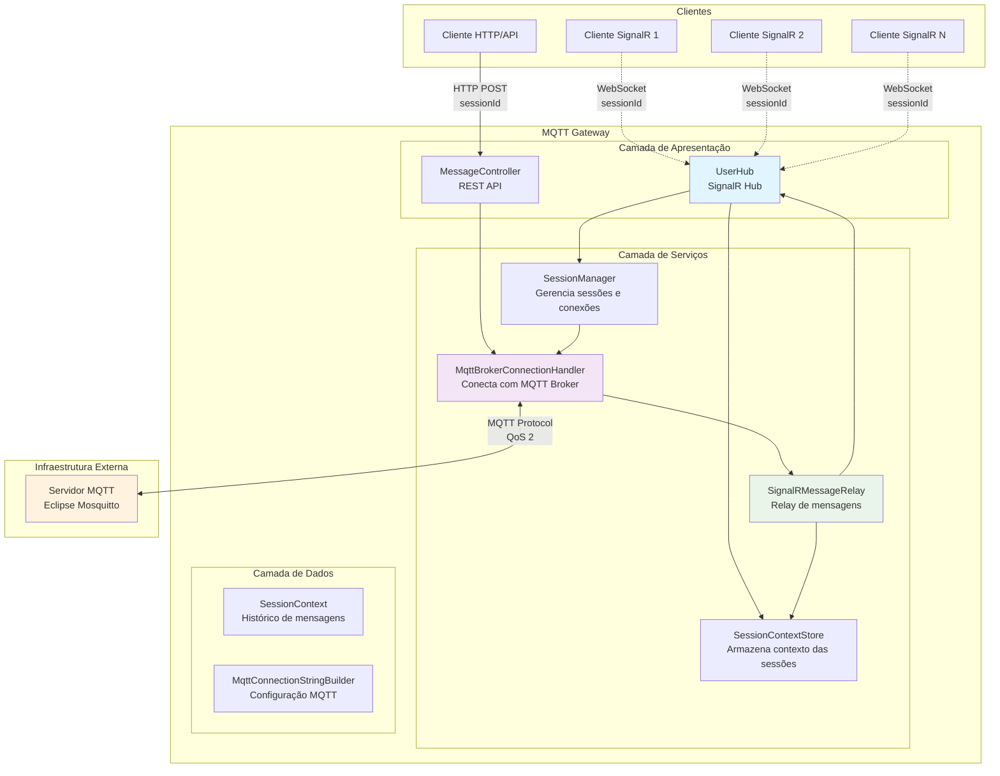
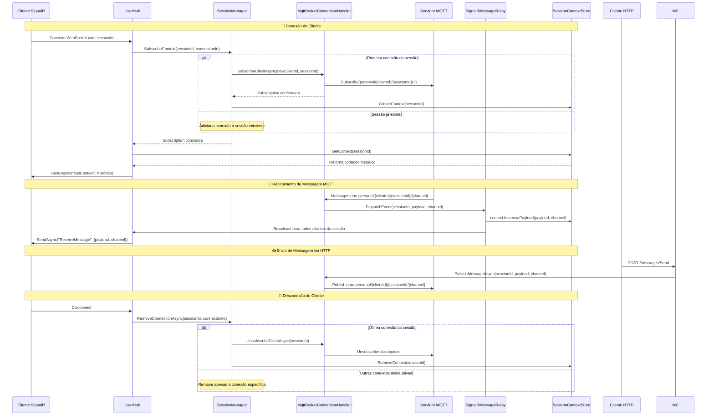
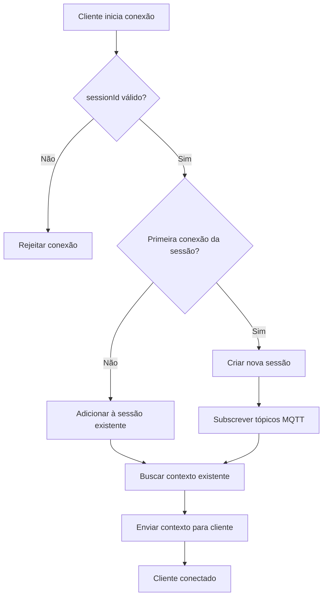
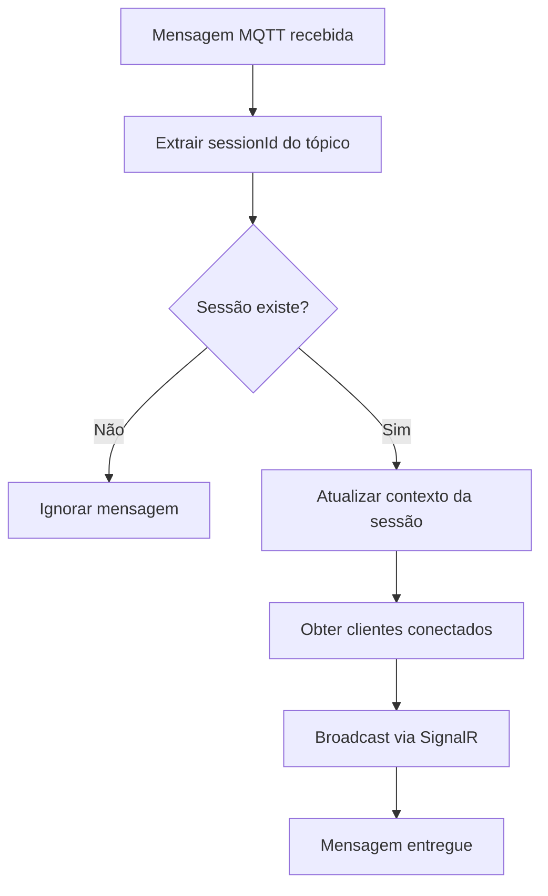
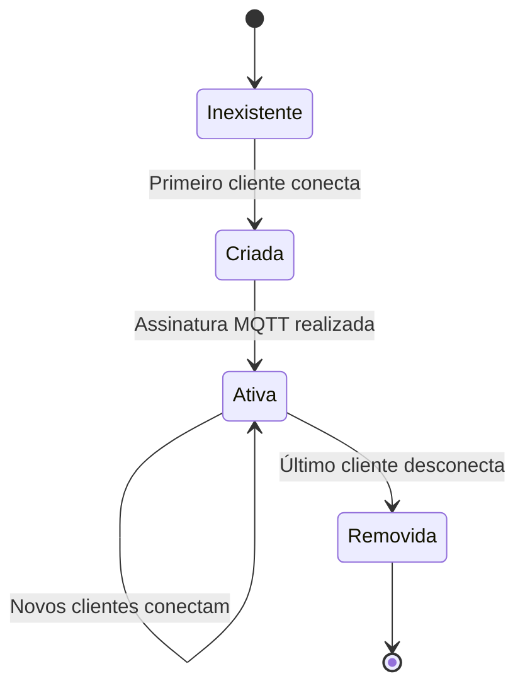
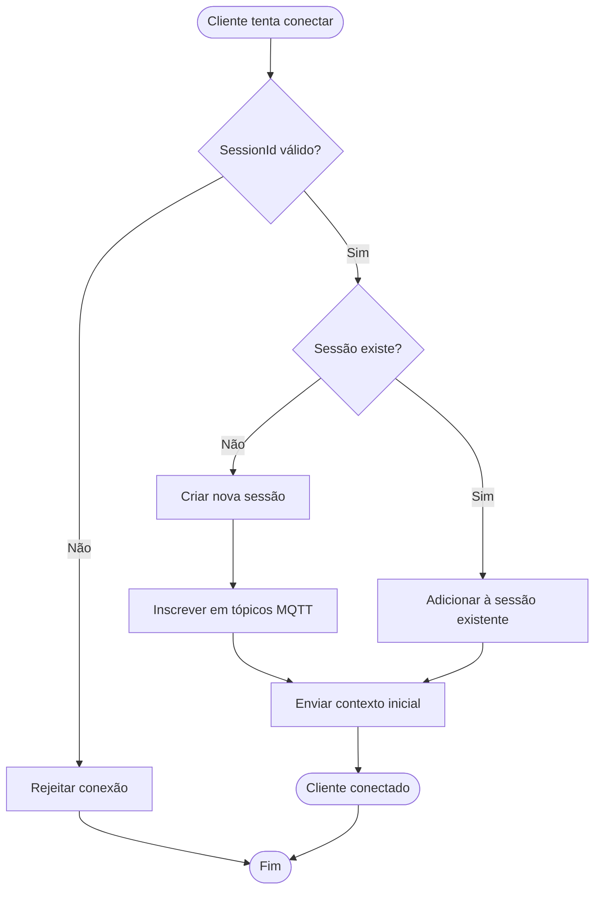

# MQTT Gateway

## 📋 Visão Geral

O MQTT Gateway é uma API ASP.NET Core que atua como uma ponte inteligente entre clientes SignalR e um servidor MQTT, proporcionando comunicação em tempo real full-duplex através de sessões contextualizadas e persistentes.

> Como o foco principal do projeto é a comunicação entre clientes e um servidor MQTT, não há validações como Autenticação e Autorização, pois o foco é apenas enviar e receber as mensagens em tempo real.

### 🎯 Características Principais

- **Comunicação Full-Duplex**: Clientes podem enviar e receber mensagens via SignalR e MQTT
- **Gerenciamento de Sessões Inteligente**: Cada sessão mantém um contexto persistente de mensagens
- **Assinatura Otimizada**: Evita assinaturas duplicadas para a mesma sessão no broker MQTT
- **Contexto Persistente**: Novos clientes recebem automaticamente o histórico completo da sessão
- **API REST Integrada**: Endpoints HTTP para envio de mensagens e integração externa
- **Escalabilidade**: Suporte a múltiplos clientes por sessão com sincronização automática

## 🏗️ Arquitetura

### Diagrama de Arquitetura Geral



### Fluxo de Dados Detalhado



### Diagrama de Classes

```mermaid
classDiagram
    class UserHub {
        +OnConnectedAsync() Task
        +OnDisconnectedAsync(Exception) Task
        -TryGetSessionId(out Guid) bool
        -SessionExists(Guid) bool
    }
    
    class ISessionManager {
        <<interface>>
        +SubscribeContext(Guid, string, CancellationToken) Task~bool~
        +RemoveConnectionAsync(Guid, string, CancellationToken) Task~bool~
        +RelayClients(Guid) HashSet~string~
    }
    
    class SessionManagerService {
        -_sessions List~Guid~
        -_relays Dictionary~Guid, HashSet~string~~
        +SubscribeContext(Guid, string, CancellationToken) Task~bool~
        +RemoveConnectionAsync(Guid, string, CancellationToken) Task~bool~
        +RelayClients(Guid) HashSet~string~
        -ExistsSession(Guid) bool
    }
    
    class IMqttBrokerConnectionHandler {
        <<interface>>
        +SubscribeClientAsync(Guid, Guid, CancellationToken) Task
        +UnsubscribeClientAsync(Guid, CancellationToken) Task
        +SetDispatcher(IMqttEventDispatcher) void
    }
    
    class IMqttMessageDispatcher {
        <<interface>>
        +PublishMessageAsync(Guid, string, string, CancellationToken) Task
    }
    
    class IMqttEventDispatcher {
        <<interface>>
        +DispatchEvent(Guid, string, string) void
    }
    
    class MqttBrokerConnectionHandler {
        -_sessionClients Dictionary~Guid, Guid~
        -_connectionStringBuilder MqttConnectionStringBuilder
        -mqttClient IMqttClient
        +SubscribeClientAsync(Guid, Guid, CancellationToken) Task
        +UnsubscribeClientAsync(Guid, CancellationToken) Task
        +PublishMessageAsync(Guid, string, string, CancellationToken) Task
        +SetDispatcher(IMqttEventDispatcher) void
        -HandlerMessageReceivedAsync(MqttApplicationMessageReceivedEventArgs) Task
        -GetTopicBySessionId(Guid, string) string
    }
    
    class SignalRMessageRelay {
        +DispatchEvent(Guid, string, string) void
    }
    
    class ISessionContextStore {
        <<interface>>
        +GetContext(Guid) SessionContext
        +RemoveContext(Guid) bool
        +CreateContext(Guid, string) bool
    }
    
    class SessionContextStore {
        -_sessions Dictionary~Guid, SessionContext~
        +CreateContext(Guid, string) bool
        +GetContext(Guid) SessionContext
        +RemoveContext(Guid) bool
    }
    
    class SessionContext {
        -histories List~History~
        +IncressPayload(string, string) void
    }
    
    class History {
        <<struct>>
        +Payload string
        +Channel string
    }
    
    class MessageController {
        +SendMessage(Guid, string, string) void
    }
    
    class MqttConnectionStringBuilder {
        +ClientId string
        +Server string
        +Port int
        +User string
        +Password string
        +TrustedConnection bool
        +CleanSession bool
    }
    
    UserHub --> ISessionManager
    UserHub --> ISessionContextStore
    SessionManagerService --|> ISessionManager
    SessionManagerService --> IMqttBrokerConnectionHandler
    SessionManagerService --> ISessionContextStore
    MqttBrokerConnectionHandler --|> IMqttBrokerConnectionHandler
    MqttBrokerConnectionHandler --|> IMqttMessageDispatcher
    MqttBrokerConnectionHandler --> MqttConnectionStringBuilder
    MqttBrokerConnectionHandler --> IMqttEventDispatcher
    SignalRMessageRelay --|> IMqttEventDispatcher
    SignalRMessageRelay --> ISessionManager
    SignalRMessageRelay --> ISessionContextStore
    SessionContextStore --|> ISessionContextStore
    SessionContextStore --> SessionContext
    SessionContext --> History
    MessageController --> IMqttMessageDispatcher
```



## 🔧 Componentes Principais

### 1. **UserHub** - Hub SignalR
Gerencia conexões WebSocket dos clientes e coordena o ciclo de vida das sessões.

**Responsabilidades:**
- Validação de sessões e conexões
- Integração com SessionManager para assinaturas
- Envio do contexto histórico para novos clientes
- Gerenciamento de desconexões

### 2. **SessionManager** - Gerenciador de Sessões
Controla o mapeamento entre sessões e conexões ativas, otimizando assinaturas MQTT.

**Características:**
- **Assinatura Inteligente**: Evita múltiplas assinaturas para a mesma sessão
- **Cleanup Automático**: Remove sessões quando não há clientes conectados
- **Relay de Conexões**: Mantém lista de conexões ativas por sessão

### 3. **MqttBrokerConnectionHandler** - Ponte MQTT
Interface única com o servidor MQTT externo, implementando padrão de reconexão e QoS.

**Funcionalidades:**
- Conexão persistente com broker MQTT
- QoS 2 (Exactly Once) para garantia de entrega
- Padrão de tópicos: `personal/{clientId}/{sessionId}/{channel?}`
- Dispatcher pattern para desacoplamento

### 4. **SignalRMessageRelay** - Distribuidor de Mensagens
Relay inteligente que atualiza contexto e distribui mensagens para clientes conectados.

**Operações:**
- Atualização automática do contexto da sessão
- Broadcast para todos os clientes da sessão
- Sincronização entre MQTT e SignalR

### 5. **SessionContextStore** - Armazenamento de Contexto
Store em memória para histórico de mensagens por sessão.

**Características:**
- Persistência em memória durante o ciclo de vida da aplicação
- Histórico completo de mensagens por sessão
- Auto-limpeza quando sessão é removida

## 📡 Estrutura de Tópicos MQTT

### Padrão de Tópicos
```
personal/{clientId}/{sessionId}/{directId?}/{channel?}
```

**Componentes:**
- `personal`: Namespace base para todos os tópicos
- `{clientId}`: UUID único gerado para cada sessão ativa
- `{sessionId}`: GUID da sessão fornecido pelo cliente
- `{targetId}`: GUID de um cliente especifico da mensagem (opcional)
- `{channel}`: Canal opcional para categorizar mensagens (opcional)

**Exemplos:**
```
personal/a1b2c3d4-e5f6-7890-abcd-ef1234567890/550e8400-e29b-41d4-a716-446655440000/notifications
personal/a1b2c3d4-e5f6-7890-abcd-ef1234567890/550e8400-e29b-41d4-a716-446655440000/alerts
personal/a1b2c3d4-e5f6-7890-abcd-ef1234567890/550e8400-e29b-41d4-a716-446655440000
```

## 🚀 API Endpoints

### REST API

#### **POST** `/Messages/Send`
Envia mensagem para uma sessão específica via MQTT.

**Parâmetros:**
```json
{
  "sessionId": "550e8400-e29b-41d4-a716-446655440000",
  "message": "Conteúdo da mensagem",
  "targetId": "12345678-1234-1234-1234-1234567890ab", // opcional
  "channel": "notifications" // opcional
}
```
> Os headers `source-service` e `timestamp-utc` sempre são enviados em Mensagens MQTT para fins de rastreabilidade. Já o header `x-target-id` somente quando é uma mensagem direta.

### SignalR Hub

#### **Endpoint:** `/hub`

**Eventos do Cliente:**
- `OnConnectedAsync`: Conexão automática com validação de sessionId
- `OnDisconnectedAsync`: Limpeza automática de recursos

**Eventos do Servidor:**
- `SetContext`: Enviado na conexão com histórico da sessão
- `ReceiveMessage`: Mensagem recebida via MQTT

**Exemplo de Conexão:**
```javascript
const connection = new signalR.HubConnectionBuilder()
    .withUrl("/hub?sessionId=550e8400-e29b-41d4-a716-446655440000")
    .build();

connection.on("SetContext", (context) => {
    console.log("Contexto da sessão:", context);
});

connection.on("ReceiveMessage", (data) => {
    console.log("Nova mensagem:", data.Payload, "Canal:", data.Channel);
});
```

## ⚙️ Configuração

### Connection String MQTT

Configure no `appsettings.json`:

```json
{
  "ConnectionStrings": {
    "MqttBroker": "Server=localhost;Port=1883;User=username;Password=password;CleanSession=true"
  }
}
```

**Parâmetros suportados:**
- `Server`: Endereço do servidor MQTT
- `Port`: Porta (padrão: 1883)
- `User`: Usuário para autenticação (opcional)
- `Password`: Senha para autenticação (opcional)
- `TrustedConnection`: Usar TLS (opcional)
- `CleanSession`: Sessão limpa (padrão: false)

### Docker Compose

O projeto inclui configuração Docker com Mosquitto MQTT:

```yaml
version: '3.4'

services:
  mqttgateway.server:
    image: ${DOCKER_REGISTRY-}mqttgatewayserver
    build:
      context: .
      dockerfile: MqttGateway.Server/Dockerfile
    depends_on:
      - mosquitto

  mosquitto:
    image: eclipse-mosquitto:latest
    container_name: mosquitto
    restart: unless-stopped
    ports:
      - "1883:1883"
      - "9001:9001"
    volumes:
      - ./mosquitto/config:/mosquitto/config
      - ./mosquitto/data:/mosquitto/data
      - ./mosquitto/log:/mosquitto/log
```

## 🔄 Fluxos de Trabalho

### Fluxo de Conexão de Cliente



### Fluxo de Processamento de Mensagem



## 🛠️ Instalação e Execução

### Pré-requisitos

- .NET 8.0 SDK
- Docker & Docker Compose (opcional)
- Servidor MQTT (Mosquitto recomendado)

### Execução Local

1. **Clone o repositório:**
```bash
git clone <repository-url>
cd MQTTBrokerHub
```

2. **Configure a connection string:**
Edite `appsettings.json` com suas configurações MQTT.

3. **Execute a aplicação:**
```bash
cd Solution/MqttGateway.Server
dotnet run
```

### Execução com Docker

1. **Execute o ambiente completo:**
```bash
cd Solution
docker-compose up -d
```

Isso iniciará:
- API na porta 8080 (HTTP) / 8081 (HTTPS)
- Mosquitto MQTT na porta 1883
- WebSocket disponível em `/hub`

### Teste da API

**Swagger UI:** `https://localhost:8081/swagger`

**Teste via cURL:**
```bash
curl -X POST "https://localhost:8081/Messages/Send" \
     -H "Content-Type: application/json" \
     -d '{
       "sessionId": "550e8400-e29b-41d4-a716-446655440000",
       "message": "Hello World!",
       "channel": "test"
     }'
```

## 🔍 Monitoramento e Logs

### Logs Estruturados

A aplicação utiliza logging estruturado do ASP.NET Core:

```json
{
  "Logging": {
    "LogLevel": {
      "Default": "Information",
      "Microsoft.AspNetCore.SignalR": "Debug",
      "MqttGateway.Server": "Debug"
    }
  }
}
```

### Métricas Importantes

- **Sessões Ativas**: Número de sessões com pelo menos um cliente conectado
- **Conexões SignalR**: Total de conexões WebSocket ativas
- **Mensagens MQTT**: Taxa de mensagens recebidas/enviadas
- **Contextos Ativos**: Número de contextos de sessão em memória

## 🚨 Tratamento de Erro e Recuperação

### Estratégias de Resilência

1. **Reconexão MQTT**: Automática em caso de falha de conexão
2. **Cleanup de Sessões**: Remoção automática de sessões órfãs
3. **Validação de Entrada**: Verificação rigorosa de sessionId e dados
4. **Graceful Degradation**: Funcionamento parcial em caso de falhas

### Cenários de Erro Comuns

| Erro | Causa | Solução |
|------|-------|---------|
| Conexão MQTT falha | Broker indisponível | Retry automático com backoff |
| SessionId inválido | Formato incorreto | Rejeição imediata da conexão |
| Contexto não encontrado | Sessão expirada | Criação de novo contexto |
| Tópico inválido | Parsing de mensagem MQTT | Log de erro e ignorar mensagem |

## 📈 Otimizações e Performance

### Estratégias Implementadas

1. **Singleton Services**: SessionManager e stores são singleton para eficiência
2. **Assinatura Única**: Evita múltiplas assinaturas MQTT para mesma sessão
3. **QoS 2**: Garantia de entrega exactly-once para mensagens críticas
4. **Cleanup Automático**: Liberação de recursos quando sessões ficam inativas

### Considerações de Escala

- **Horizontal**: Múltiplas instâncias requerem store distribuído (Redis)
- **Vertical**: Store em memória adequado para cargas médias
- **MQTT**: Broker dedicado para ambientes de produção
- **SignalR**: Scale-out com Azure SignalR Service ou Redis backplane

## 🔒 Segurança

### Implementações Atuais

- **Validação de SessionId**: GUID obrigatório e válido
- **Cleanup de Recursos**: Prevenção de vazamentos de memória
- **MQTT QoS**: Garantia de integridade das mensagens

### Melhorias Recomendadas

- [ ] Autenticação de usuários no SignalR
- [ ] Autorização baseada em sessões
- [ ] Rate limiting para APIs
- [ ] Criptografia de payloads sensíveis
- [ ] Audit trail de mensagens

## 🤝 Contribuição

1. Fork o projeto
2. Crie uma branch para sua feature (`git checkout -b feature/AmazingFeature`)
3. Commit suas mudanças (`git commit -m 'Add some AmazingFeature'`)
4. Push para a branch (`git push origin feature/AmazingFeature`)
5. Abra um Pull Request

## 📄 Licença

Este projeto está licenciado sob a Licença MIT - veja o arquivo [LICENSE](LICENSE) para detalhes.

## 🆘 Suporte

Para suporte e questões:

1. **Issues**: Abra uma issue no GitHub
2. **Documentação**: Consulte este README
3. **Logs**: Verifique os logs da aplicação para debugging

---

**Desenvolvido com ❤️ usando .NET 8, SignalR e MQTTnet**
    UH->>C: Entrega mensagem
    
    Note over C,SCS: Envio de Mensagem via API
    C->>+MC: POST /Messages/Send
    MC->>MBCH: PublishMessageAsync(sessionId, message)
    MBCH->>MQTT: Publish mensagem
    MC-->>-C: 200 OK
```

## 🛠️ Tecnologias Utilizadas

- **ASP.NET Core 8.0** - Framework web
- **SignalR** - Comunicação em tempo real
- **MQTTnet** - Cliente MQTT
- **Swagger/OpenAPI** - Documentação da API
- **Docker** - Containerização

## 📁 Estrutura do Projeto

```
MqttGatway.Server/
├── Controllers/
│   └── MessageController.cs      # API REST para envio de mensagens
├── Hubs/
│   └── UserHub.cs               # Hub SignalR para clientes
├── Services/
│   ├── MqttBrokerConnectionHandler.cs  # Gerencia conexão MQTT
│   ├── SessionManagerService.cs        # Gerencia sessões
│   ├── SignalRMessageRelay.cs          # Relay MQTT → SignalR
│   ├── SessionContextStore.cs          # Armazena contexto das sessões
│   └── Contracts/                      # Interfaces
├── Objects/
│   ├── SessionContext.cs               # Modelo de contexto
│   └── MqttConnectionStringBuilder.cs  # Builder para conexão MQTT
└── Program.cs                          # Configuração da aplicação
```

## ⚙️ Configuração

### 1. Connection String MQTT

Configure a conexão MQTT no `appsettings.json`:

```json
{
  "ConnectionStrings": {
    "MqttBroker": "Server=localhost;Port=1883;CleanSession=true;User=usuario;Password=senha"
  }
}
```

#### Parâmetros da Connection String

| Parâmetro | Obrigatório | Padrão | Descrição |
|-----------|-------------|--------|-----------|
| `Server` | ✅ | - | Endereço do servidor MQTT |
| `Port` | ❌ | 1883 | Porta do servidor MQTT |
| `CleanSession` | ❌ | false | Iniciar sessão limpa |
| `User` | ❌ | - | Usuário para autenticação |
| `Password` | ❌ | - | Senha para autenticação |
| `TrustedConnection` | ❌ | - | Usar conexão TLS |
| `ClientId` | ❌ | - | ID do cliente MQTT |

### 2. Executar com Docker Compose

```bash
docker-compose up -d
```

### 3. Executar Localmente

```bash
dotnet run --project Solution/MqttGateway.Server
```

## 🔌 Como Usar

### 1. Conectar Cliente SignalR

```javascript
const connection = new signalR.HubConnectionBuilder()
    .withUrl("/hub?sessionId=123e4567-e89b-12d3-a456-426614174000")
    .build();

// Receber contexto inicial
connection.on("SetContext", function (context) {
    console.log("Contexto da sessão:", context);
});

// Receber mensagens em tempo real
connection.on("ReceiveMessage", function (data) {
    console.log("Nova mensagem:", data.Payload, "Canal:", data.Channel);
});

await connection.start();
```

### 2. Enviar Mensagem via API REST

```bash
curl -X POST "https://localhost:7001/Messages/Send" \
  -H "Content-Type: application/json" \
  -d '{
    "sessionId": "123e4567-e89b-12d3-a456-426614174000",
    "message": "Olá mundo!",
    "channel": "chat"
  }'
```

### 3. Tópicos MQTT

O sistema utiliza o seguinte padrão de tópicos:

```
personal/{clientId}/{sessionId}/{channel}
```

**Exemplo:**
- `personal/abc123/123e4567-e89b-12d3-a456-426614174000/chat`
- `personal/abc123/123e4567-e89b-12d3-a456-426614174000/notifications`

## 🎯 Funcionalidades Detalhadas

### Gerenciamento de Sessões

- **Criação Automática**: Sessões são criadas automaticamente quando o primeiro cliente se conecta
- **Compartilhamento**: Múltiplos clientes podem compartilhar a mesma sessão
- **Limpeza**: Sessões são removidas quando o último cliente se desconecta

### Contexto de Mensagens

- **Histórico Persistente**: Todas as mensagens são armazenadas no contexto da sessão
- **Entrega Imediata**: Novos clientes recebem o contexto completo ao se conectar
- **Organização por Canal**: Mensagens podem ser categorizadas por canais

### Otimização de Assinaturas

- **Assinatura Única**: O sistema se inscreve nos tópicos apenas uma vez por sessão
- **Desinscrição Automática**: Remove assinaturas quando a sessão fica vazia
- **QoS 2**: Garante entrega exata das mensagens MQTT

## 🔄 Estados e Ciclo de Vida

### Diagrama de Estados da Sessão



### Fluxo de Conexão do Cliente



## 🚀 Endpoints da API

### POST /Messages/Send

Envia uma mensagem para uma sessão específica.

**Parâmetros:**
- `sessionId` (Guid): ID da sessão
- `message` (string): Conteúdo da mensagem
- `channel` (string, opcional): Canal da mensagem

**Exemplo de Resposta:**
```http
HTTP/1.1 200 OK
```

### WebSocket /hub

Endpoint SignalR para conexão em tempo real.

**Query Parameters:**
- `sessionId` (Guid): ID da sessão para conectar

**Métodos do Hub:**
- `SetContext`: Recebe o contexto inicial da sessão
- `ReceiveMessage`: Recebe mensagens em tempo real

## 🐛 Troubleshooting

### Problemas Comuns

1. **Cliente não recebe mensagens**
   - Verificar se o `sessionId` está correto
   - Confirmar conexão com servidor MQTT
   - Validar tópicos MQTT

2. **Conexão SignalR falha**
   - Verificar formato do `sessionId` (deve ser GUID válido)
   - Confirmar URL do hub (`/hub`)

3. **Mensagens não persistem**
   - Implementar `SessionContextStore` (atualmente `NotImplementedException`)

### Logs e Debugging

Configure o nível de log no `appsettings.json`:

```json
{
  "Logging": {
    "LogLevel": {
      "Default": "Information",
      "MqttGateway.Server": "Debug"
    }
  }
}
```

## 🔮 Próximos Passos

- [ ] Implementar `SessionContextStore` com persistência (Redis/Database)
- [ ] Adicionar autenticação e autorização
- [ ] Implementar retry logic para conexões MQTT
- [ ] Adicionar métricas e monitoramento
- [ ] Implementar rate limiting
- [ ] Adicionar suporte a SSL/TLS para MQTT

## 🧪 Testes

O projeto inclui uma suíte abrangente de testes seguindo padrões da indústria para garantir qualidade, confiabilidade e performance do sistema.

### Estrutura de Testes

```
MqttGateway.Tests/
├── Unit/                    # Testes unitários
│   ├── Controllers/         # Testes dos controllers
│   ├── Services/           # Testes dos serviços
│   └── Objects/            # Testes dos objetos de domínio
├── Integration/            # Testes de integração
├── Performance/            # Testes de performance e carga
├── Fixtures/               # Configurações e utilities para testes
└── Helpers/                # Classes auxiliares para testes
```

### Tecnologias de Teste

- **xUnit**: Framework principal de testes
- **FluentAssertions**: Assertions mais legíveis e expressivas
- **Moq**: Mocking framework para isolamento de dependências
- **ASP.NET Core Test Host**: Host de teste integrado
- **MQTTnet.TestMqttServer**: Servidor MQTT em memória para testes
- **Coverlet**: Análise de cobertura de código

### Tipos de Testes

#### 🔬 **Testes Unitários** (Unit/)
- ⚡ Execução rápida (< 100ms por teste)
- 🔒 Isolamento total com mocks
- 📊 Alta cobertura de código (>90%)
- 🧩 Testa lógica de negócio específica

**Cobertura:**
- `SessionContextStore` - Armazenamento de contexto
- `SessionManagerService` - Gerenciamento de sessões  
- `SignalRMessageRelay` - Relay de mensagens
- `MessageController` - Controller de API

#### 🔄 **Testes de Integração** (Integration/)
- 🌐 API REST e SignalR funcionais
- 📡 Comunicação real entre camadas
- ⚙️ Configuração próxima ao ambiente real
- 🔗 Fluxos completos de dados

**Cenários:**
- Endpoints da API REST
- Conexões SignalR Hub
- Fluxo completo: API → SignalR
- Isolamento entre sessões
- Múltiplos clientes por sessão

#### 🚀 **Testes End-to-End** (Integration/EndToEndIntegrationTests.cs)
- 🔄 Fluxo completo: API → MQTT → SignalR
- 📊 Servidor MQTT real em memória
- 🔗 Múltiplas sessões e clientes
- 💾 Persistência de contexto

#### ⚡ **Testes de Performance** (Performance/)
- 📈 Latência de API (< 100ms)
- 🚀 Throughput (> 20 req/s)
- 🔌 Tempo de conexão SignalR
- 💾 Uso de memória
- 📊 Performance sob carga

### Executando os Testes

#### Script PowerShell (Recomendado)

```powershell
# Executar todos os testes
.\run-tests.ps1

# Apenas testes unitários
.\run-tests.ps1 -TestType unit

# Testes de integração
.\run-tests.ps1 -TestType integration

# Testes com cobertura de código
.\run-tests.ps1 -TestType all -Coverage

# Testes de performance
.\run-tests.ps1 -TestType performance

# Testes específicos
.\run-tests.ps1 -TestType custom -Filter "ClassName~SessionManager"
```

#### Comandos .NET CLI

```bash
# Restaurar e executar todos os testes
dotnet test Solution/MqttGateway.Tests/

# Testes unitários apenas
dotnet test --filter "FullyQualifiedName~Unit"

# Testes de integração
dotnet test --filter "FullyQualifiedName~Integration"

# Com cobertura de código
dotnet test --collect:"XPlat Code Coverage"

# Verboso para debugging
dotnet test --verbosity detailed
```

### Métricas de Qualidade

#### Cobertura de Código
- **Serviços**: > 90%
- **Controllers**: > 85% 
- **Hubs**: > 80%
- **Geral**: > 85%

#### Performance SLAs
- **API Response**: < 100ms
- **Throughput**: > 20 requests/segundo
- **SignalR Connection**: < 1s para 50 conexões
- **End-to-End Latency**: < 1s

#### Thresholds de Confiabilidade
- **Taxa de Sucesso**: > 99.9%
- **Tempo de Reconexão**: < 5s
- **Perda de Mensagens**: < 0.1%

### Fixtures e Helpers Avançados

#### WebApplicationFactory Customizada
```csharp
var factory = MqttGatewayWebApplicationFactory.Create(
    useMockServices: true,
    configureServices: services => {
        // Configuração customizada para teste específico
    });
```

#### SignalR Test Helper
```csharp
await using var signalRHelper = new SignalRTestHelper();
await signalRHelper.ConnectAsync(hubUrl, sessionId);
var messageReceived = await signalRHelper.WaitForMessageAsync(
    msg => msg.Payload == "test", TimeSpan.FromSeconds(5));
```

#### MQTT Test Client
```csharp
await using var mqttClient = new MqttTestClient();
await mqttClient.ConnectAsync("localhost", 1883);
await mqttClient.PublishAsync("topic", "message");
var received = await mqttClient.WaitForTopicMessageAsync("topic", TimeSpan.FromSeconds(5));
```

### Documentação Detalhada

Para informações completas sobre os testes, incluindo:
- 📋 Convenções e padrões
- 🛠️ Debugging de testes
- 🔄 Integração CI/CD
- 🚨 Troubleshooting

Consulte: [`Solution/MqttGateway.Tests/README.md`](Solution/MqttGateway.Tests/README.md)

## 🔮 Próximos Passos

- [ ] Implementar persistência real para `SessionContextStore` (Redis/Database)
- [ ] Adicionar autenticação e autorização JWT
- [ ] Implementar retry logic para conexões MQTT
- [ ] Adicionar métricas e monitoramento (Prometheus/Grafana)
- [ ] Implementar rate limiting e throttling
- [ ] Adicionar suporte completo a SSL/TLS para MQTT
- [ ] Implementar clustering para alta disponibilidade
- [ ] Adicionar health checks detalhados
.\run-tests.ps1 -Command integration   # Apenas testes de integração
.\run-tests.ps1 -Command coverage      # Todos os testes com cobertura
```

### Cobertura de Código
Os testes visam manter uma cobertura mínima de 80%, com relatórios HTML gerados automaticamente.

Veja o [README de Testes](Solution/MqttGateway.Tests/README.md) para documentação completa.

## 📄 Licença

Este projeto está licenciado sob a licença MIT. Veja o arquivo [LICENSE](LICENSE) para mais detalhes.

## 🤝 Contribuição

Contribuições são bem-vindas! Por favor, siga as diretrizes de contribuição e abra uma issue antes de implementar mudanças significativas.